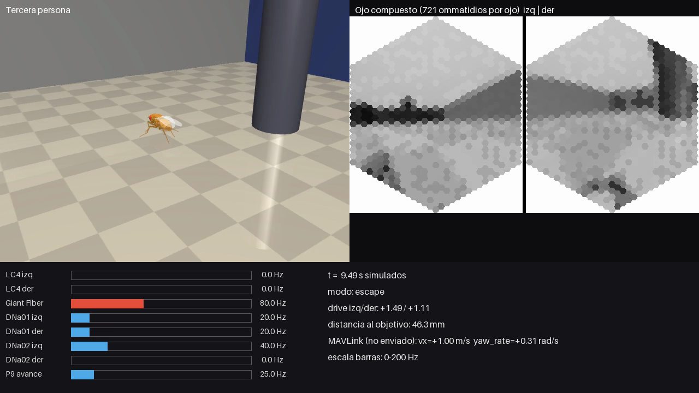

# fly-room-demo

Una *Drosophila* simulada con cerebro conectómico completo (FlyWire v783: 138.639 neuronas LIF y
15.091.983 sinapsis) camina por una habitación 3D en MuJoCo. El código se separa en tres capas
(sensores, cerebro, actuadores) para que el mismo cerebro pueda controlar después un dron real.



Video completo: [`docs/room_demo.mp4`](docs/room_demo.mp4) (30 s simulados, 1280×720, 30 fps).
A la izquierda, la cámara de seguimiento en tercera persona; a la derecha, lo que ve el ojo compuesto
(721 ommatidios por ojo). Abajo, las tasas de LC4, Giant Fiber, DNs de giro (DNa01/DNa02) y P9, junto
con el comando MAVLink equivalente, que se calcula pero no se envía.

## Qué hay adentro

- **Cerebro**: el modelo LIF de [fly-brain](https://github.com/erojasoficial-byte/fly-brain), copiado
  sin modificaciones en `vendor/fly_brain/` (ver `UPSTREAM.md`).
- **Cuerpo**: NeuroMechFly v2 sobre [FlyGym](https://github.com/NeLy-EPFL/flygym) **1.2.1**.
- **Arena** (`flyroom/arena.py`): habitación de 80×80 mm con 4 paredes de texturas distintas
  (franjas, damero, degradado y color plano), 2 cajas y 2 pilares, un foco cenital con sombras y una
  esfera roja como objetivo.

```
 frames RGB ──► sensors.py ──► brain.py ──► actuators.py ──► FlyGym (hoy)
 (MuJoCo hoy,   ojo compuesto   LIF 138k     DNs → drive     MAVLink vx/yaw_rate
  cámara mañana) → tasas T2     step() → Hz  izq/der         (stub, sin enviar)
```

| Capa | Interfaz | Hoy | Para el dron |
|---|---|---|---|
| `flyroom/sensors.py` | `FrameSource.read() -> (rgb_izq, rgb_der)`; `CompoundEyeEncoder.encode(...) -> (ommatidios, índices, tasas)` | `MujocoEyeCameras` | una clase con el mismo `read()` que lea de una cámara real (512×450 RGB por ojo) |
| `flyroom/brain.py` | `Brain.step(sensory) -> dict[str, Hz]` | CPU (ver GPU más abajo) | sin cambios |
| `flyroom/actuators.py` | `command(rates, visual_threat_bias) -> dict` | `FlyGymActuator` (usa `BrainBodyBridge` original) | `MAVLinkActuator`: arma `SET_POSITION_TARGET_LOCAL_NED` en `MAV_FRAME_BODY_NED` con vx y yaw_rate, y lo deja en `last_packet` sin enviarlo |

## Instalación

Probado en macOS (Apple M5, 16 GB, sin GPU CUDA) con Python 3.11.

```bash
python3.11 -m venv .venv
.venv/bin/pip install -r requirements.txt
./scripts/fetch_data.sh        # ~135 MB del conectoma, fijados al commit vendorizado
```

Con una GPU NVIDIA hay que instalar torch desde el índice de CUDA correspondiente
(por ejemplo `--index-url https://download.pytorch.org/whl/cu126`). `BrainEngine` usa `cuda` si existe.

## Uso

```bash
.venv/bin/python run_room_demo.py --duration 30          # video, CSV y métricas en outputs/
.venv/bin/python scripts/control_sin_vision.py           # control: GF sin entrada visual
```

## Resultados de la corrida de 30 s (`docs/room_demo_metrics.json`)

| Métrica | Valor |
|---|---|
| Pasos de física (dt = 0,1 ms) | 300.000, a **508 pasos/s** |
| Pasos de cerebro | 3.000 (uno cada 100 pasos de física, igual que fly-brain) |
| Factor tiempo real | **0,051×** (30 s simulados en 590 s de pared) |
| Reparto del tiempo | física 387 s · cerebro 152 s · video 26 s · visión 23 s |
| Frames de video generados | 901, a 1,5 frames/s de pared |
| RAM pico (RSS) | **1,99 GB** (2,0 a 2,6 GB entre corridas) |
| GPU | no hay CUDA; el cerebro corrió en CPU con 4 hilos de torch |
| Objetivo alcanzado | **no**: distancia mínima 16,4 mm |
| Recuperaciones de física | 2 (t = 11,55 s y 23,02 s), sin reinicios silenciosos |

Lo que muestra la corrida:

1. Con P9 tónico (estímulo por defecto de fly-brain) la mosca camina hacia +x.
2. El Giant Fiber empieza a disparar en t ≈ 3,1 s y la mosca entra en modo escape en t ≈ 6,7 s,
   cerca de la caja oscura, gira y huye hacia la pared sur.
3. Pasa el resto de la corrida alternando entre caminar (54 % de los frames) y escapar (46 %).

## Problemas encontrados y cómo se resolvieron

1. **fly-brain usa la API de FlyGym 1.x** (`SingleFlySimulation`, `flygym.examples.locomotion`).
   El repo actual de FlyGym es la 2.1.0, que reescribió la API y no es compatible. Solución: `flygym==1.2.1`.
2. **Pesos plásticos en Git LFS**: sin `git-lfs`, `data/plastic_weights.pt` es un puntero de 133 bytes y
   `torch.load` falla con `UnpicklingError`. Para el demo base se instaló `git-lfs`. Este demo no los usa:
   parte del conectoma v783 puro, apuntando `plastic_path` a un archivo que no existe.
3. **pandas 3 rompe `visual_system.py`** (`TypeError: expected string or bytes-like object, got 'float'`,
   porque `astype(str)` deja NaN como float con strings de Arrow). Solución: `pandas<3`.
4. **`HybridTurningController` exige sensores de contacto** en tibia y tarsos. Se configuran igual que en
   `fly_embodied.py`.
5. **Sin CUDA**: `BrainEngine` solo elige entre `cuda` y `cpu`. MPS está disponible pero no se probó,
   porque habría que tocar el modelo. Un paso de cerebro cuesta unos 50 ms en CPU.
6. **`PhysicsError: mjWARN_BADQACC`**. En la primera corrida la simulación se cortó en t = 10,75 s al chocar
   con la pared sur en modo escape. Workaround: guardar el estado de integración de MuJoCo cada 100 ms y
   restaurarlo ante el error. El CPG y el cerebro no se rebobinan, y en el video se nota un salto de hasta
   3,7 mm. En la corrida final hubo 2 errores: uno contra la pared y otro en piso libre, en (0, -19);
   la causa de este último no está determinada.
7. **Bug de reinicio silencioso**, detectado en la tercera corrida. Ante un BADQACC, MuJoCo ejecuta
   `mj_resetData`, que devuelve la mosca a la pose inicial, y deja el contador de warnings en 1. Si el
   contador ya estaba en 1, dm_control no ve el cambio y no lanza la excepción, así que la mosca se
   teletransporta al origen sin aviso. Solución: poner los contadores en cero al restaurar. Además, el
   script detecta cualquier retroceso del reloj de MuJoCo y lo reporta en `reinicios_silenciosos_t_s`.
   El `continue` tras un error en `fly_embodied.py` de upstream tiene el mismo problema latente.

## Limitaciones: qué no demuestra este demo

- **No hay navegación hacia el objetivo.** Ningún circuito del modelo busca la esfera roja: es solo un
  punto de referencia visual. El movimiento sale de P9 tónico (avance) y de los giros y escapes que
  dispara la visión.
- **La entrada visual no son fotorreceptores.** `VisualSystem` de fly-brain identifica R1-R8, pero solo
  inyecta la vía OFF (neuronas T2) con tasas basadas en contraste. Según el propio código, inyectar
  fotorreceptores generaba ruido que activaba el GF.
- **El escape no pasa por LC4 ni LPLC2.** En los 30 s ninguna de esas poblaciones disparó (0 Hz), aunque
  el GF sí lo hizo. El control sin visión (`scripts/control_sin_vision.py`, 1.000 pasos) deja el GF en
  0 Hz, así que la activación depende de la entrada T2, pero por otra ruta del conectoma que no se
  identificó.
- **Escala temporal heredada de fly-brain.** Cada paso de cerebro dura 0,1 ms, pero se ejecuta uno cada
  10 ms de cuerpo, así que el cerebro avanza 100 veces más lento que el cuerpo. La ventana de 50 ms del
  decodificador de DNs equivale a 5 s de cuerpo.
- **Plasticidad Hebbiana activa**, como en upstream: los pesos cambian durante la corrida y no se guardan.

## Portar a dron

`MAVLinkActuator` ya produce el paquete. Para enviarlo faltaría abrir una conexión y escribir
`last_packet`, por ejemplo con `mavutil.mavlink_connection("udpout:127.0.0.1:14550").write(pkt)` en SITL.
Eso no está hecho. La convención de signo se validó con la trayectoria simulada: cuando drive_izq >
drive_der, el rumbo gira en sentido horario (−2,2 rad/s en promedio), lo que corresponde a un yaw_rate
positivo en NED. Del lado sensorial falta una clase `FrameSource` que lea de una cámara real y entregue
dos frames de 512×450.

## Créditos y licencias

- fly-brain, © 2026 Enrique Manuel Rojas Aliaga, MIT (`vendor/fly_brain/LICENSE`).
- FlyGym / NeuroMechFly v2, NeLy-EPFL, Apache-2.0 (dependencia pip, no vendorizada).
- Conectoma FlyWire v783 (Dorkenwald et al. 2024, Schlegel et al. 2024).
